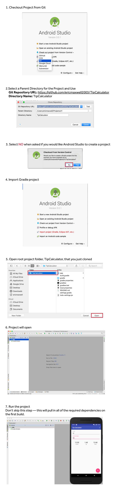

# TipCalculator
Simple Tip Calculator to illustrate the concepts of DataBinding & MVVM.

### Lab 0 : Import Project

These instructions will help you download, configure and open the starter
project in Android Studio. **Ideally this should be done before the conference.**  The companion screen shots are from a Mac, but the instructions apply to both Windows/PC and Macs.

